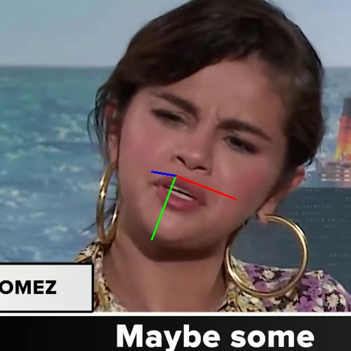

# EMO: Emote Portrait Alive - 
using chatgpt to reverse engineer code from HumanAIGC/EMO white paper. Work in progress - WIP


Just copy and paste the html from here in chatgpt (custom chat)
https://chat.openai.com/g/g-UzGVIbBpB-diffuser-wizard
https://arxiv.org/html/2402.17485v1


The Moore-AnimateAnyone seems very close to this implementation - it was ripped off from magicanimate 
(which cherry picked from animatediff) it has training code train_stage_1.py
https://github.com/MooreThreads/Moore-AnimateAnyone/blob/master/train_stage_1.py


## Training Data

- **Total Videos:** 36,000 facial videos
- **Total Size:** 40GB

### Torrent Download

You can download the dataset via the provided magnet link or by visiting [Academic Torrents](https://academictorrents.com/details/843b5adb0358124d388c4e9836654c246b988ff4).

```plaintext
magnet:?xt=urn:btih:843b5adb0358124d388c4e9836654c246b988ff4&dn=CelebV-HQ&tr=https%3A%2F%2Facademictorrents.com%2Fannounce.php&tr=https%3A%2F%2Fipv6.academictorrents.com%2Fannounce.php
```

### Original Video

[](https://youtu.be/M2Ohb0FAaJU_1)

### Sample Video (Cropped & Trimmed)

Note: The sample includes rich tagging. For more details, see `./data/test.json`.

[](./junk/M2Ohb0FAaJU_1.mp4)


What chat gpt says...


https://docs.google.com/spreadsheets/d/1meRHgcFZ8mxWplvJweAd-5P_tkH0UeD2eT2Ot_k46jA/edit#gid=865829673


https://github.com/johndpope/Emote-hack/blob/main/Net.py

```javascript

-✅ FramesEncodingVAE
  - __init__(input_channels, latent_dim, img_size, reference_net)
  - reparameterize(mu, logvar)
  - forward(reference_image, motion_frames, speed_value)
  - vae_loss(recon_frames, reference_image, motion_frames, reference_mu, reference_logvar, motion_mu, motion_logvar)

- DownsampleBlock
  - __init__(in_channels, out_channels)
  - forward(x)

- UpsampleBlock
  - __init__(in_channels, out_channels)
  - forward(x1, x2)

- ✅ ReferenceNet
  - __init__(vae_model, speed_encoder, config)
  - forward(reference_image, motion_frames, head_rotation_speed)

- ✅ SpeedEncoder
  - __init__(num_speed_buckets, speed_embedding_dim)
  - get_bucket_centers()
  - get_bucket_radii()
  - encode_speed(head_rotation_speed)
  - forward(head_rotation_speeds)

- CrossAttentionLayer
  - __init__(feature_dim)
  - forward(latent_code, audio_features)

- AudioAttentionLayers
  - __init__(feature_dim, num_layers)
  - forward(latent_code, audio_features)

-✅ EMOModel
  - __init__(vae, image_encoder, config)
  - forward(noisy_latents, timesteps, ref_image, motion_frames, audio_features, head_rotation_speeds)

-✅ Wav2VecFeatureExtractor
  - __init__(model_name, device)
  - extract_features_from_mp4(video_path, m, n)
  - extract_features_for_frame(video_path, frame_index, m)

- AudioFeatureModel
  - __init__(input_size, output_size)
  - forward(x)

-✅ FaceLocator
  - __init__()
  - forward(images)

-✅ FaceHelper
  - __init__()
  - __del__()
  - generate_face_region_mask(frame_image, video_id, frame_idx)
  - generate_face_region_mask_np_image(frame_np, video_id, frame_idx, padding)
  - generate_face_region_mask_pil_image(frame_image, video_id, frame_idx)
  - calculate_pose(face2d)
  - draw_axis(img, yaw, pitch, roll, tdx, tdy, size)
  - get_head_pose(image_path)
  - get_head_pose_velocities_at_frame(video_reader, frame_index, n_previous_frames)

- EmoVideoReader
  - __init__(pixel_transform, cond_transform, state)
  - augmentedImageAtFrame(index)
  - augmentation(images, transform, state)

-✅ EMODataset
  - __init__(use_gpu, data_dir, sample_rate, n_sample_frames, width, height, img_scale, img_ratio, video_dir, drop_ratio, json_file, stage, transform)
  - __len__()
  - augmentation(images, transform, state)
  - __getitem__(index)

  ```


```javascript
- EMOAnimationPipeline (copied from magicanimate)
  - has some training code
```

 

